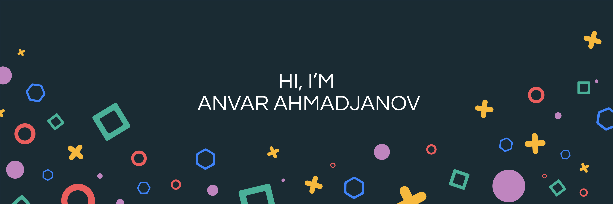

---

### Hey there 

I’m **Anvar**, a creative front-end engineer passionate about building intuitive, performant, and scalable web applications.

🔗 Want to know more about me? [Check out my portfolio.](https://anvarmirzo.github.io/me/public/)

---

## 📊 GitHub Stats

  

  

---

## 💼 Skills

### Languages & Frameworks

More Skills

 

#### Styling

#### Back-end & Fullstack

#### Testing

#### DevOps & Tools

#### Design & Collaboration

---
